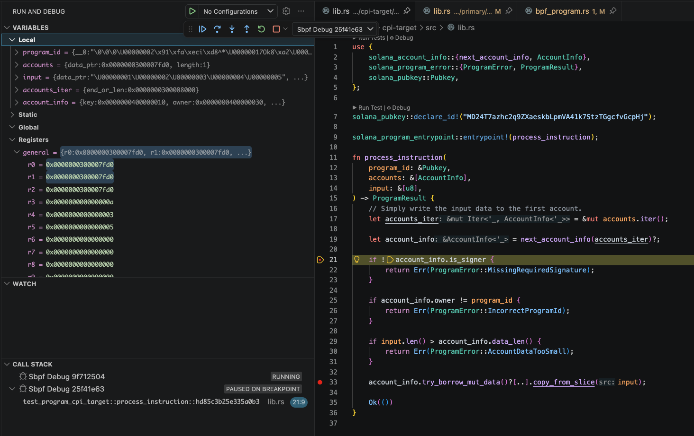

# Gimlet

Gimlet is a VSCode Extension that makes Solana smart contract debugging seamless, automated, and fully integrated into the VS Code experience, eliminating the need for manual configuration or terminal-only workflows.



---

## Table of Contents

- [Prerequisites](#prerequisites)
- [Introduction](#introduction)
- [Usage](#usage)
- [Example Project](#example-project)
- [Troubleshooting](#troubleshooting)

---

## Prerequisites

Before using Gimlet, ensure you have the following tools installed:

| Tool             | Installation Command                                                                                   | Notes                |
|------------------|--------------------------------------------------------------------------------------------------------|----------------------|
| `rust-analyzer`  | [Rust Analyzer Extension](https://marketplace.visualstudio.com/items?itemName=rust-lang.rust-analyzer) | VSCode extension     |
| `codeLLDB`       | [CodeLLDB Extension](https://marketplace.visualstudio.com/items?itemName=vadimcn.vscode-lldb)          | VSCode extension     |
| `solana-cli`     | [Solana Docs](https://solana.com/docs/intro/installation)                                              | Use latest version   |
| `platform-tools` | [Solana Docs](https://solana.com/docs/intro/installation)                                              | Use versions >= 1.54 |

---

## Introduction

Gimlet uses LiteSVM to execute its tests. Each test transaction can start a VM instance running in SBPF, which exposes a gdbstub for debugging over TCP. Gimlet connects to this gdbstub using a specified `tcpPort`. It then launches `lldb` with a special library provided by the Solana platform-tools, enabling LLDB to load and debug ELF files—your compiled SBPF programs. It also supports CPI (Cross-Program Invocation) debugging.

---

## Getting Started with Gimlet

Gimlet makes debugging Solana programs inside VS Code effortless. Follow these steps to get started:

### 1. Automatic Configuration

When you open your Solana project, **Gimlet** automatically creates a `.vscode/gimlet.json` configuration file.  
You can customize this file to:
- Specify a different **platform-tools version**
- Change the default **TCP port** used for debugging
- Control whether the debugger **stops on entry** or runs straight to your first breakpoint  

| Option                 | Default  | Description                                                                 |
|------------------------|----------|-----------------------------------------------------------------------------|
| `tcpPort`              | `1212`   | TCP port the gdbstub listens on                                             |
| `platformToolsVersion` | `"1.54"` | Solana platform-tools version                                               |
| `stopOnEntry`          | `true`   | Stop at program entry point; set to `false` to skip to the first breakpoint |
| `sbfTraceDir`          | `null`   | Relative path from the workspace root to the SBF trace directory; defaults to `target/sbf/trace` |

Gimlet also adjusts a few **VS Code workspace settings** to ensure smooth integration.

### 2. Setup Steps

1. **Open VS Code** in your Solana project folder.  
2. **Install the Gimlet extension** from the [VS Code Marketplace](https://marketplace.visualstudio.com/items?itemName=emilroydev.gimlet-beta).  
3. **Build your program** with debug symbols:
   ```sh
   cargo-build-sbf --tools-version v1.54 --debug --arch v1
   ```
4. **Run your test** with the debugger enabled:
   ```sh
   SBF_DEBUG_PORT=1212 SBF_TRACE_DIR=$PWD/target/sbf/trace cargo test --features sbpf-debugger
   ```
5. **Open the test file in VS Code** — you’ll see a **CodeLens button** above it labeled:
   - `Sbpf Debug` → for individual Rust tests  
   - `Sbpf Debug All` → for TypeScript test suites  
6. **Click the button** to connect **Gimlet** and start step-by-step debugging.  

---

## Example Project

Example Anchor and Pinocchio programs to test Gimlet are available [here](https://github.com/ERoydev/anchor-litesvm-debugger-example).

---

## Troubleshooting

### Permission Denied When Trying to Debug a Program

Refer to the [Apple Developer Forum thread](https://forums.developer.apple.com/forums/thread/17452) for instructions on disabling debugging protection for macOS systems.

---

### Platform-tools

We recommend using platform-tools version **v1.54**.  
To force-install the correct version inside your Rust project, run:

```sh
cargo build-sbf --tools-version v1.54 --debug --arch v1 --force-tools-install
```

### Windows (WSL)

#### Common Issues and Solutions

##### `libpython 3.10.so.1.0` Not Found or Executable Not Found

```bash
sudo apt update
sudo add-apt-repository ppa:deadsnakes/ppa
sudo apt update
sudo apt install python3.10 python3.10-dev
python3.10 --version
```
